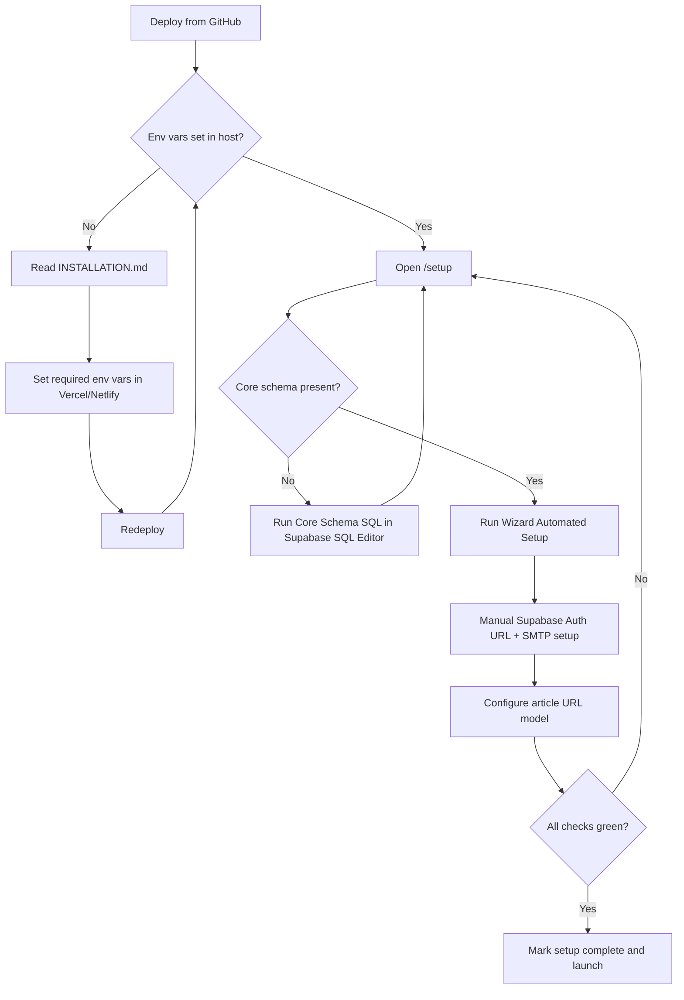

# AdAstro Installation Guide (Vercel/Netlify + Supabase)

This is the canonical install document for AdAstro v1.0.0.

Use this file as your source of truth during setup. The `/setup` wizard is a guided assistant, but some tasks must still be done in Supabase/Vercel/Netlify dashboards.

## Installation Philosophy

- Keep setup safe for non-empty databases.
- Keep bundled features (`ai`, `comments`, `newsletter`) present but inactive by default.
- Keep manual steps minimal, explicit, and platform-specific.
- Use wizard automation only after required environment variables are set and deployed.

## What The Wizard Can And Cannot Do

Wizard can do (once env vars are set and deployed):
- Validate setup readiness.
- Apply default settings.
- Keep bundled feature flags inactive by default.
- Configure and create required storage buckets.
- Bootstrap admin role by email (and optionally invite if missing).
- Save article URL model (`content.articleBasePath`, `content.articlePermalinkStyle`).

Wizard cannot do reliably:
- Set Vercel/Netlify environment variables for you.
- Force a host redeploy after env var updates.
- Configure Supabase SMTP provider and sender identity.
- Run every privileged DB operation without the initial manual schema SQL.

## Required Environment Variables

Set these in your hosting provider (Vercel or Netlify):

```bash
SUPABASE_URL=
SUPABASE_PUBLISHABLE_KEY=
SUPABASE_SECRET_KEY=
```

Notes:
- `SITE_URL` is strongly recommended for canonical URLs and redirects.
- If `SITE_URL` is missing, setup can fall back to the detected deployment URL.
- Any env var change requires a redeploy before the app can use it.
- Full env var reference (feature keys, CDN overrides, adapter/storage overrides) lives in `docs/environment-variables.md`.

## Step-By-Step Install

### 1) Create Supabase Project

1. Create a new Supabase project.
2. Keep the dashboard open for API keys, SQL Editor, Auth, and Storage.

### 2) Fetch Supabase Keys

In Supabase project settings/API area, copy:

- `SUPABASE_URL` = project API URL (`https://<project-ref>.supabase.co`)
- `SUPABASE_PUBLISHABLE_KEY` = publishable client key
- `SUPABASE_SECRET_KEY` = secret server key

Keep `SUPABASE_SECRET_KEY` server-only.

### 3) Set Hosting Env Vars And Redeploy

#### Vercel

1. Open Project -> Settings -> Environment Variables.
2. Add required Supabase vars (optionally add `SITE_URL` now or later).
3. Redeploy the project.

#### Netlify

1. Open Site configuration -> Environment variables.
2. Add required Supabase vars (optionally add `SITE_URL` now or later).
3. Trigger a new deploy.

### 4) Open `/setup`

After redeploy, open `/setup`.

Expected behavior for RC flow:
- The app should continue routing to `/setup` until setup is completed.
- Env checks are first-class and shown before DB automation.

### 5) Run Core SQL (Manual, One Time)

In `/setup`, copy **Core Schema SQL** and run it in Supabase SQL Editor.

Why manual:
- This step establishes schema safely with idempotent SQL (`IF NOT EXISTS`) and is the baseline for wizard automation.

### 6) Run Wizard Automation

In `/setup` step **Auth + Email Sender**, run **Automated Setup**.

This should:
- Initialize default settings.
- Ensure bundled feature flags are inactive.
- Configure storage bucket names for this instance and create them if missing.
- Assign admin role by email (and optionally invite if user does not exist).
- Optionally set/reset the admin password in the same setup action.

### 7) Complete Manual Auth/Email Tasks

In Supabase Auth settings:

1. Set URL configuration:
   - Site URL = root domain only (example: `https://adastrocms.vercel.app`, no `/auth/callback`)
   - Redirect URLs allow-list must include:
     - `https://<site>/auth/callback`
     - `https://<site>/auth/callback?redirect=/auth/reset-password?next=%2Fadmin`
     - `https://<site>/auth/callback?redirect=/auth/reset-password?next=%2Fadmin%2Fposts`
     - `https://<site>/auth/callback?redirect=/auth/reset-password?next=%2Fprofile`
     - `https://<site>/auth/reset-password`
2. Configure SMTP/email sender:
   - From name
   - From email
   - SMTP provider credentials
3. Customize auth email templates (recommended):
   - Supabase Dashboard → Auth → Templates.
   - Update subject/body for Invite + Recovery emails.
   - Keep `{{ .ConfirmationURL }}` in invite/recovery templates so secure links remain valid.
   - You can use `{{ .RedirectTo }}` and `{{ .SiteURL }}` placeholders in template copy.
4. Send a test auth email.
5. Optional social login (GitHub/Google):
   - Enable provider in Supabase Dashboard → Auth → Providers.
   - Add provider credentials in Supabase.
   - In AdAstro Admin → Settings → Authentication, enable:
     - `auth.oauth.github.enabled` and/or
     - `auth.oauth.google.enabled`
   - Social buttons only render when both App setting + Supabase provider are enabled.

Important:
- If invite emails still point to `localhost`, your Supabase Auth URL configuration is still using a local value. Update it to match `SITE_URL`.

### 8) Configure Article URL Model

Use setup wizard (or admin settings) to set:

- `content.articleBasePath` (example: `blog`, `posts`, `articles`)
- `content.articlePermalinkStyle` (`segment` or `wordpress`)

This protects slug compatibility for imported WordPress content.

### 9) Final Smoke Test

1. Login works at `/auth/login`.
2. Forgot password flow works at `/auth/forgot-password`.
3. Invite acceptance sends user to `/auth/reset-password` before dashboard/profile redirect.
4. Admin works at `/admin`.
5. Publish one post and verify public URL.
6. Toggle each bundled feature on/off.
7. Confirm no blocking checks remain in `/setup`.

### 10) Mark Setup Complete

In `/setup` Step 5 (**Verification**), click **Mark Setup Complete**.

Until this flag is set:
- the app keeps redirecting non-setup routes to `/setup`
- env and core checks must be complete before launch

## Admin Password + Role Script (Optional Final Step)

If you want to explicitly set/reset the admin password and enforce admin role at the end:

```bash
npm run admin:bootstrap -- --email you@example.com --password 'UseAStrongPassword123!'
```

What it does:
- Finds or creates the Supabase auth user.
- Sets the user password.
- Sets `app_metadata.role = "admin"`.
- Creates/updates matching `authors` profile (if core schema is present).

Requirements:
- `SUPABASE_URL` and `SUPABASE_SECRET_KEY` must already be set in your environment.
- Run this from the project root.

## Setup Lifecycle Diagram



## Existing Database Safety Notes

- Core SQL is additive/idempotent and intended for non-empty DBs.
- Do not run destructive reset commands on production data.
- Always validate schema and auth settings in `/setup` after changes.

## Optional / Advanced Variables

See `docs/environment-variables.md` for:
- feature-specific keys (newsletter, AI)
- advanced CDN keys
- adapter override (`ASTRO_ADAPTER`)
- bucket override variables (`MEDIA_STORAGE_BUCKET`, `MIGRATION_UPLOADS_BUCKET`)

Notes:
- By default, storage bucket names are derived from your `SITE_URL` host (for safer multi-instance setups).
- You can override bucket names explicitly with `MEDIA_STORAGE_BUCKET` and `MIGRATION_UPLOADS_BUCKET`.
