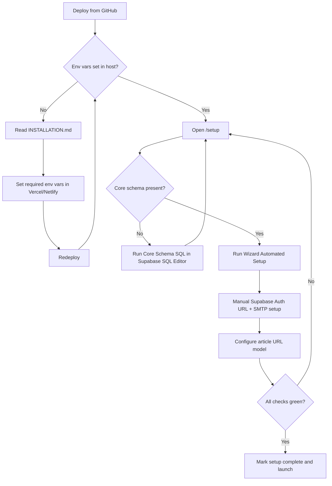

# AdAstro Installation Guide (Vercel/Netlify + Supabase)

This is the canonical install document for AdAstro v1.5.0.

Use this file as your source of truth during setup. The `/setup` wizard is a guided assistant, but some tasks must still be done in Supabase/Vercel/Netlify dashboards.

## Installation Philosophy

- Keep setup safe for non-empty databases.
- Keep bundled features (`ai`, `comments`, `newsletter`) present but inactive by default.
- Keep manual steps minimal, explicit, and platform-specific.
- Use wizard automation only after required environment variables are set and deployed.

## What The Wizard Can And Cannot Do

Wizard can do (once env vars are set and deployed):
- Validate setup readiness.
- Apply default settings.
- Keep bundled feature flags inactive by default.
- Configure and create required storage buckets.
- Bootstrap admin role by email (and optionally invite if missing).
- Save article URL model (`content.articleBasePath`, `content.articlePermalinkStyle`).
- Save locale model (`content.defaultLocale`, `content.locales`) and provision required localized system pages.

Wizard cannot do reliably:
- Set Vercel/Netlify environment variables for you.
- Force a host redeploy after env var updates.
- Configure Supabase SMTP provider and sender identity.
- Configure Supabase social-provider credentials, Azure tenant mode, or Entra token claim mapping.
- Configure Supabase Auth rate limits, CAPTCHA/Turnstile, or dashboard-level abuse controls.
- Enable Supabase MFA factors for your project.
- Run every privileged DB operation without the initial manual schema SQL.

## Required Environment Variables

Set these in your hosting provider (Vercel or Netlify):

```bash
SUPABASE_URL=
SUPABASE_PUBLISHABLE_KEY=
SUPABASE_SECRET_KEY=
```

Notes:
- `SITE_URL` is required for stable auth callbacks, invite links, password-reset links, and canonical URLs on hosted deployments.
- Only local development may fall back to the request origin for auth redirects.
- Any env var change requires a redeploy before the app can use it.
- Full env var reference (feature keys, CDN overrides, adapter/storage overrides) lives in `docs/environment-variables.md`.

## Step-By-Step Install

### 1) Create Supabase Project

1. Create a new Supabase project.
2. Keep the dashboard open for API keys, SQL Editor, Auth, and Storage.

### 2) Fetch Supabase Keys

In Supabase project settings/API area, copy:

- `SUPABASE_URL` = project API URL (`https://<project-ref>.supabase.co`)
- `SUPABASE_PUBLISHABLE_KEY` = publishable client key
- `SUPABASE_SECRET_KEY` = secret server key

Keep `SUPABASE_SECRET_KEY` server-only.

### 3) Set Hosting Env Vars And Redeploy

#### Vercel

1. Open Project -> Settings -> Environment Variables.
2. Add required Supabase vars and set `SITE_URL` to the deployed root domain before testing auth flows.
3. Redeploy the project.

#### Netlify

1. Open Site configuration -> Environment variables.
2. Add required Supabase vars and set `SITE_URL` to the deployed root domain before testing auth flows.
3. Trigger a new deploy.

### 4) Open `/setup`

After redeploy, open `/setup`.

Expected behavior for RC flow:
- The app should continue routing to `/setup` until setup is completed.
- Env checks are first-class and shown before DB automation.

### 5) Run Core SQL (Manual, One Time)

In `/setup`, copy **Core Schema SQL** and run it in Supabase SQL Editor.

Why manual:
- This step establishes schema safely with idempotent SQL (`IF NOT EXISTS`) and is the baseline for wizard automation.

### 6) Run Wizard Automation

In `/setup` step **Auth + Email Sender**, run **Automated Setup**.

This should:
- Initialize default settings.
- Ensure bundled feature flags are inactive.
- Configure storage bucket names for this instance and create them if missing.
- Assign admin role by email (and optionally invite if user does not exist).
- Optionally set/reset the admin password in the same setup action.

### 7) Complete Manual Auth/Email Tasks

In Supabase Auth settings:

1. Set URL configuration:
   - Site URL = root domain only (example: `https://adastrocms.vercel.app`, no `/auth/callback`)
   - Redirect URLs allow-list must include:
     - `https://<site>/auth/callback`
     - `https://<site>/auth/callback?redirect=/auth/reset-password?next=%2Fadmin`
     - `https://<site>/auth/callback?redirect=/auth/reset-password?next=%2Fadmin%2Fposts`
     - `https://<site>/auth/callback?redirect=/auth/reset-password?next=%2Fprofile`
     - `https://<site>/auth/reset-password`
2. Configure SMTP/email sender:
   - From name
   - From email
   - SMTP provider credentials
3. Customize auth email templates (recommended):
   - Supabase Dashboard → Auth → Templates.
   - Update subject/body for Invite + Recovery emails.
   - Keep `{{ .ConfirmationURL }}` in invite/recovery templates so secure links remain valid.
   - You can use `{{ .RedirectTo }}` and `{{ .SiteURL }}` placeholders in template copy.
4. Send a test auth email.
5. Optional social login (GitHub/Google):
   - Enable provider in Supabase Dashboard → Auth → Providers.
   - Add provider credentials in Supabase.
   - In AdAstro Admin → Settings → Authentication, enable:
     - `auth.oauth.github.enabled` and/or
     - `auth.oauth.google.enabled` and/or
     - `auth.oauth.azure.enabled`
   - Social buttons only render when both App setting + Supabase provider are enabled.
6. Optional Microsoft login via Supabase Azure provider:
   - Provider name in Supabase is `azure`.
   - Supabase callback URL in Microsoft Entra must be `https://<project-ref>.supabase.co/auth/v1/callback`.
   - AdAstro still requires your site callback in Supabase Redirect URLs: `https://<site>/auth/callback`.
   - Azure sign-in must request the `email` scope; AdAstro adds that automatically on the login entrypoint.
   - Use the provider's optional tenant URL in Supabase if you want single-tenant Entra mode. Leave it on `common` for Microsoft-account / multi-tenant behavior.
   - Do not use SAML or `signInWithSSO` for AdAstro v1.5.0.
   - Microsoft Entra can emit unverified emails. Prefer adding the optional `xms_edov` claim and `email` claim in the Entra app configuration, then treat `xms_edov=true` as the safe path for email-based trust decisions.
7. Optional MFA:
   - In Supabase Dashboard → Auth → Multi-Factor Auth, enable TOTP/authenticator-app support.
   - In AdAstro Admin → Settings → Authentication, enable `auth.mfa.enabled` when you are ready to expose enrollment.
   - AdAstro keeps MFA optional. Users without verified factors keep the existing UX.
   - When `auth.mfa.enabled` is on and a user has a verified factor, sensitive account actions currently require `aal2`.
8. Recommended abuse protections:
   - Configure Supabase Auth rate limits for sign-in, OTP, password reset, MFA challenge, and MFA verify.
   - Enable Supabase CAPTCHA / Turnstile for the auth flows you expose publicly.
   - Review Supabase Security Advisor after running migrations.
   - After applying helper-function hardening migrations, verify `pg_default_acl` for `public` functions. If `supabase_admin` still grants `EXECUTE` to `anon` or `authenticated`, run the remaining `ALTER DEFAULT PRIVILEGES FOR ROLE supabase_admin ... REVOKE EXECUTE ON FUNCTIONS ...` statement in Supabase SQL Editor.
- Keep Vercel Firewall / Attack Challenge or equivalent Netlify edge protections enabled for public deployments.
- On hosted installs, create or repair the admin account with `npm run admin:bootstrap ...`, then sign in through `/auth/login` before using setup actions that mutate state (`/api/setup/automate`, `/api/setup/routing`, `/api/setup/complete`).

Important:
- If invite emails still point to `localhost`, your Supabase Auth URL configuration is still using a local value. Update it to match `SITE_URL`.
- After setup is marked complete, `/setup` re-entry is admin-only and can be disabled entirely with `setup.allowReentry=false`.

### 8) Configure Article URL Model + Public Locales

Use setup wizard (or admin settings) to set:

- `content.articleBasePath` (example: `blog`, `posts`, `articles`)
- `content.articlePermalinkStyle` (`segment` or `wordpress`)
- `content.defaultLocale`
- `content.locales`

This protects slug compatibility for imported WordPress content and ensures required localized system pages are provisioned immediately for every activated locale.

### 9) Final Smoke Test

1. Login works at `/{default-locale}/auth/login` and unprefixed auth entrypoints resolve correctly.
2. Forgot password flow works at `/{default-locale}/auth/forgot-password`.
3. Invite acceptance sends user to `/{default-locale}/auth/reset-password` before dashboard/profile redirect.
4. Admin works at `/admin`.
5. Publish one post and verify public URL.
6. Switch locale on one page and one article and confirm alternate locale routing works or falls back safely.
7. Toggle each bundled feature on/off.
8. Confirm no blocking checks remain in `/setup`.

### 10) Mark Setup Complete

In `/setup` Step 5 (**Verification**), click **Mark Setup Complete**.

Until this flag is set:
- the app keeps redirecting non-setup routes to `/setup`
- `/auth/*` and `/api/auth/*` remain reachable so the bootstrap admin can sign in during setup
- env and core checks must be complete before launch

## Admin Password + Role Script (Optional Final Step)

If you want to explicitly set/reset the admin password and enforce admin role at the end:

```bash
npm run admin:bootstrap -- --email you@example.com --password 'UseAStrongPassword123!'
```

What it does:
- Finds or creates the Supabase auth user.
- Sets the user password.
- Sets `app_metadata.role = "admin"`.
- Creates/updates matching `authors` profile (if core schema is present).

Requirements:
- `SUPABASE_URL` and `SUPABASE_SECRET_KEY` must already be set in your environment.
- Run this from the project root.

## Setup Lifecycle Diagram


```mermaid
flowchart TD
  A["Deploy from GitHub"] --> B{"Env vars set in host?"}
  B -- "No" --> C["Read INSTALLATION.md"]
  C --> D["Set required env vars in Vercel/Netlify"]
  D --> E["Redeploy"]
  E --> B
  B -- "Yes" --> F["Open /setup"]
  F --> G{"Core schema present?"}
  G -- "No" --> H["Run Core Schema SQL in Supabase SQL Editor"]
  H --> F
  G -- "Yes" --> I["Run Wizard Automated Setup"]
  I --> J["Manual Supabase Auth URL + SMTP setup"]
  J --> K["Configure article URL model"]
  K --> L{"All checks green?"}
  L -- "No" --> F
  L -- "Yes" --> M["Mark setup complete and launch"]
```

## Existing Database Safety Notes

- Core SQL is additive/idempotent and intended for non-empty DBs.
- Do not run destructive reset commands on production data.
- Always validate schema and auth settings in `/setup` after changes.

## Optional / Advanced Variables

See `docs/environment-variables.md` for:
- feature-specific keys (newsletter, AI)
- advanced CDN keys
- adapter override (`ASTRO_ADAPTER`)
- bucket override variables (`MEDIA_STORAGE_BUCKET`, `MIGRATION_UPLOADS_BUCKET`)

Notes:
- By default, storage bucket names are derived from your `SITE_URL` host (for safer multi-instance setups).
- You can override bucket names explicitly with `MEDIA_STORAGE_BUCKET` and `MIGRATION_UPLOADS_BUCKET`.
