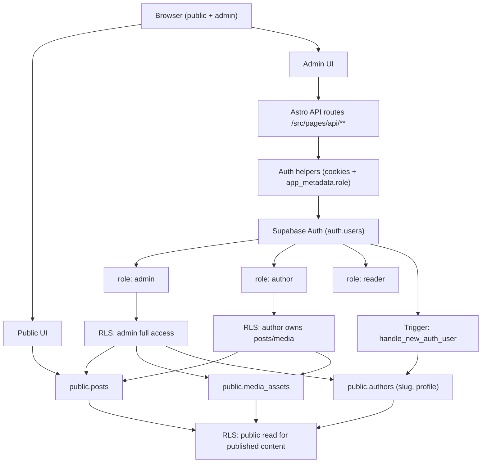

# Auth + RLS Diagram

This diagram captures how Supabase Auth, app metadata roles, and RLS policies gate access to the app.

Notes
- Roles live in `auth.users.raw_app_meta_data.role` and are read by the backend helpers.
- The `handle_new_auth_user` trigger creates an author profile and slug on user creation.
- Public reads are allowed for published content; write access is controlled by role + ownership.
- Invite and recovery links route through `/auth/callback` and are forced through `/auth/reset-password` before role-specific destinations.
- Role-safe redirects are centralized in `src/lib/auth/access-policy.ts` and enforced by both middleware and login APIs.
