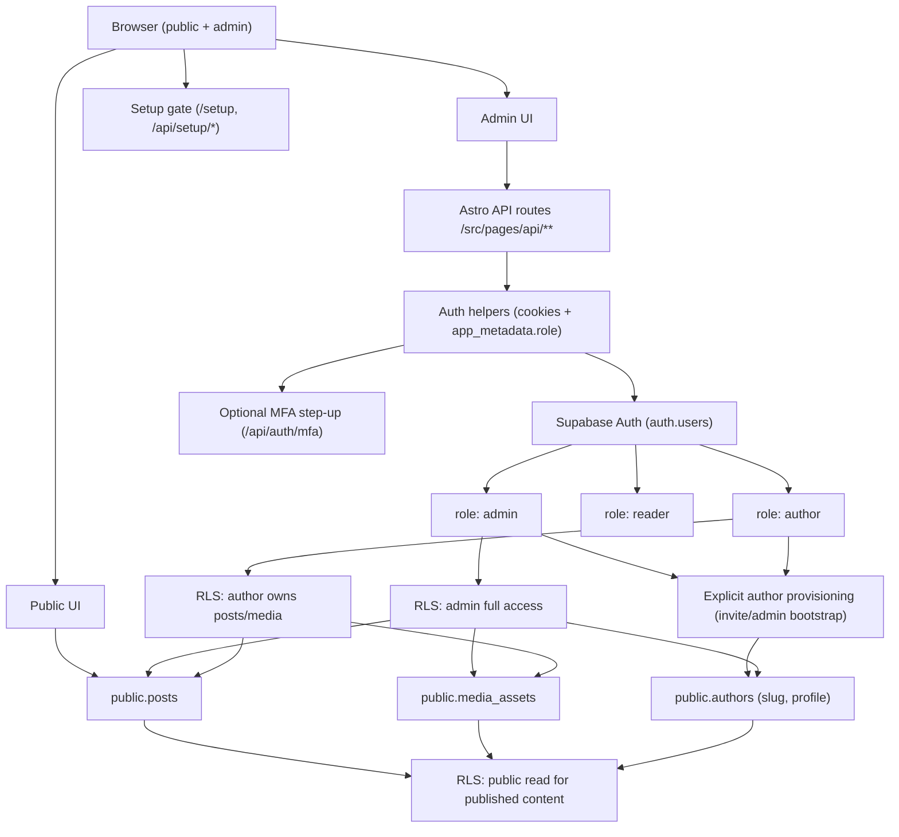

# Auth + RLS Diagram

This diagram captures how Supabase Auth, app metadata roles, MFA step-up, and RLS policies gate access to the app.

```mermaid
flowchart TD
  %% Clients
  Browser["Browser (public + admin)"]
  AdminUI["Admin UI"]
  PublicUI["Public UI"]

  %% Astro server
  ApiRoutes["Astro API routes /src/pages/api/**"]
  AuthHelpers["Auth helpers (cookies + app_metadata.role)"]

  %% Supabase
  Auth["Supabase Auth (auth.users)"]
  SetupGate["Setup gate (/setup, /api/setup/*)"]
  MFA["Optional MFA step-up (/api/auth/mfa)"]
  Provisioning["Explicit author provisioning (invite/admin bootstrap)"]
  Authors["public.authors (slug, profile)"]
  Posts["public.posts"]
  Media["public.media_assets"]

  %% Roles
  RoleAdmin["role: admin"]
  RoleAuthor["role: author"]
  RoleReader["role: reader"]

  %% RLS policies
  PublicRead["RLS: public read for published content"]
  AuthorWrite["RLS: author owns posts/media"]
  AdminWrite["RLS: admin full access"]

  Browser --> PublicUI --> Posts
  Browser --> AdminUI --> ApiRoutes
  Browser --> SetupGate
  ApiRoutes --> AuthHelpers
  AuthHelpers --> Auth
  AuthHelpers --> MFA

  Auth --> RoleAdmin
  Auth --> RoleAuthor
  Auth --> RoleReader
  RoleAdmin --> Provisioning --> Authors
  RoleAuthor --> Provisioning

  Posts --> PublicRead
  Media --> PublicRead
  Authors --> PublicRead

  RoleAuthor --> AuthorWrite
  RoleAdmin --> AdminWrite

  AdminWrite --> Posts
  AdminWrite --> Media
  AdminWrite --> Authors

  AuthorWrite --> Posts
  AuthorWrite --> Media
```

Notes
- Roles live in `auth.users.raw_app_meta_data.role` and are read by the backend helpers.
- Authenticated users without explicit role metadata resolve to `reader`.
- Author rows are now provisioned explicitly from admin/bootstrap flows; auth-user creation no longer auto-links author records by email.
- Public reads are allowed for published content; write access is controlled by role + ownership.
- Invite and recovery links route through `/auth/callback` and are forced through `/auth/reset-password` before role-specific destinations.
- Role-safe redirects are centralized in `src/lib/auth/access-policy.ts` and enforced by both middleware and login APIs.
- Optional MFA is controlled by `auth.mfa.enabled`; when enabled and a user has a verified factor, sensitive account actions require `aal2`.
- `/setup` and `/api/setup/*` stay open only before setup completion. After that, setup access requires an authenticated admin and can be disabled entirely with `setup.allowReentry=false`.
