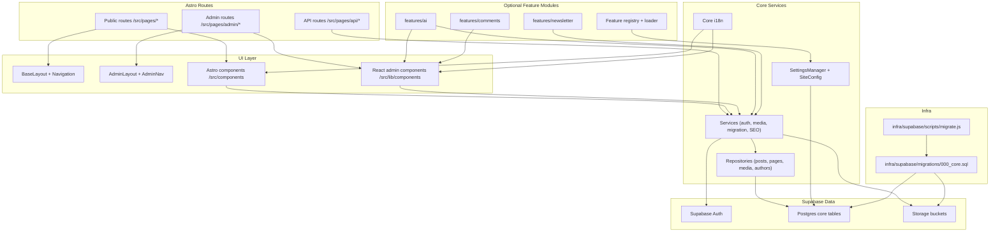

# Core Structure Diagram

> Snapshot reference: for the canonical and maintained map, use `docs/architecture/system-map.md`.

This diagram maps the core stack (public site, admin, API, services, data, infra) and how
optional feature modules plug in without being required for the core to run.

## Optimization Opportunities
- Use `count` queries + select subsets for list views instead of `getPublishedPosts()` loading full rows for pagination.
- Ensure `content_html` is generated on save for pages to avoid EditorJS serialization at request time.
- Add indexes for category/tag lookups (e.g., `post_categories.category_id`, `post_tags.tag_id`) to speed taxonomy pages.
- Cache site settings and navigation/footer settings with a short TTL to cut repeated DB reads on SSR.
- Keep sitemap and RSS endpoints cacheable with explicit `Cache-Control` + conditional headers.

## Potential Errors / Risks to Verify
- `set:html={post.content}` renders raw HTML; confirm every write path sanitizes content (admin editor, migration, API).
- `000_core.sql` includes storage policy updates that require superuser; confirm `db:setup` handles this or split into a manual step.
- `sitemap.xml.ts` assumes `updatedAt` is a `Date`; confirm repository mapping to avoid runtime `toISOString` errors.
- `authors.auth_user_id` is nullable; if you require strict auth linkage, enforce this in admin flows or schema.
