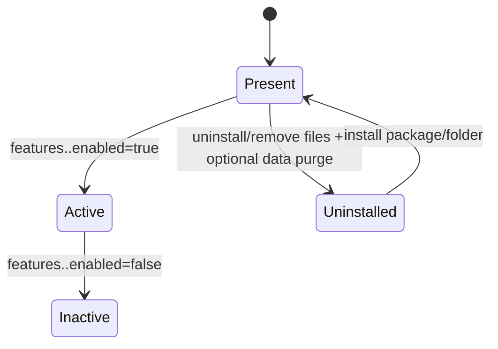

# Feature Map

## Goal
Keep core stable while allowing bundled and external features to be installed, toggled, and removed cleanly.

## 1. Feature Lifecycle

## 2. Runtime Wiring

1. Manifest registration: `src/lib/features/manifest.ts`
2. Module loading: `src/lib/features/loader.ts`
3. State check: `src/lib/features/state.ts`
4. UI extension points: `src/lib/features/ui.ts`
5. Admin settings panels: `src/lib/features/admin.ts`
6. API dispatch: `src/pages/api/features/[feature]/[action].ts` -> `src/lib/features/runtime.ts`

## 3. Bundled Features (shipped with core)

| Feature | Settings prefix | Owned tables | Public hooks | Admin hooks |
| --- | --- | --- | --- | --- |
| AI | `features.ai.*` | `ai_usage_events` | optional editor/public helpers | `/admin/features/ai` + post/media tools |
| Comments | `features.comments.*` | `comments` | blog comments component | `/admin/features/comments` moderation/settings |
| Newsletter | `features.newsletter.*` | `newsletter_subscribers`, `newsletter_campaigns`, `newsletter_deliveries` | footer signup | `/admin/features/newsletter` settings + campaign tools |

Notes:
- Bundled means "present in repo"; default state is inactive.
- Bundled and externally installed features share the same runtime contract.
- All features live under `src/lib/features/<id>/`.
- Shared security controls can live in core settings (for example `security.recaptcha.*`) and be feature-opted via `features.<id>.*` flags.

## 4. Install/Uninstall Toolchain

- Install: `infra/features/install.js`
- Uninstall: `infra/features/uninstall.js`
- SQL apply helper for bundled migrations: `src/lib/features/migrations.ts`
- Feature metadata: `feature.json` in each feature directory.

## 5. Non-Negotiable Rules

1. Feature code must not be required for core route rendering.
2. Feature APIs must fail closed when feature is inactive.
3. Feature UI must not render when feature is inactive.
4. Feature schema must be independent from core schema.
5. Uninstall must support safe deactivate and optional data purge.

## 6. External Feature Developer Checklist

1. Create `src/lib/features/<id>/` with `index.ts`, `settings.ts`, `feature.json`.
2. Export `FEATURE_MODULE` in `index.ts`.
3. Add `features.<id>.enabled` default `false`.
4. Keep DB tables namespaced to feature concern.
5. Add tests for inactive behavior, active behavior, and uninstall paths.
