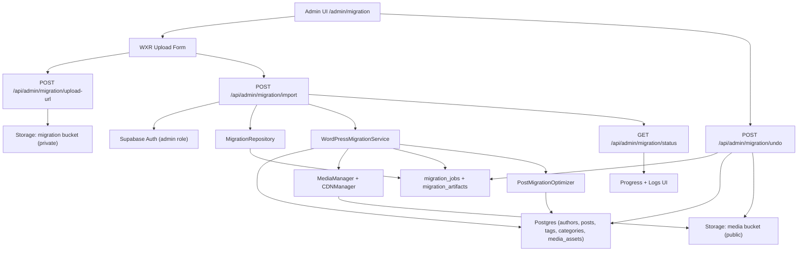

# Migration Pipeline Diagram

This diagram focuses on the WordPress migration flow, progress tracking, storage usage, and rollback path.

Notes
- Large WXR files use a signed upload URL to the configured migration bucket, then `storagePath` is passed to `/import`.
- Progress events are streamed from `/import` and displayed in the UI.
- `migration_artifacts` enables safe undo by tracking imported records per job.
- Service modules: `src/lib/services/wordpress-migration.ts` (orchestrator), `src/lib/services/wordpress-migration/parser.ts`, `src/lib/services/wordpress-migration/media-optimizer.ts`, and `src/lib/services/wordpress-migration/types.ts`.
