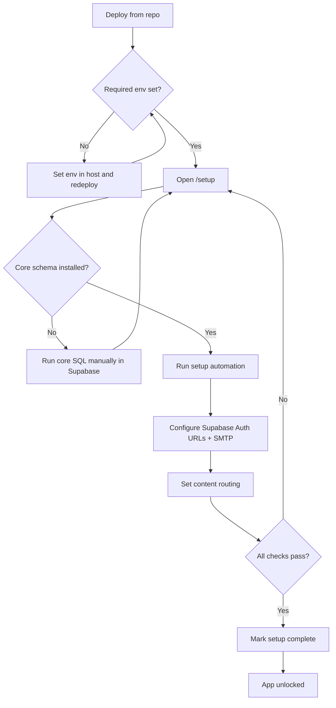

# Setup Flow

## Goal
Predictable install on Vercel/Netlify + Supabase with setup enforced until complete.

## 1. Setup Gate

- Enforced in `src/middleware.ts`.
- If required env vars are missing, non-setup routes redirect to `/setup`.
- If env vars exist but `setup.completed` is false, non-setup routes still redirect to `/setup`.
- If `setup.completed` is true and `setup.allowReentry` is false, `/setup` redirects to `/`.

Required setup env keys:
- `SUPABASE_URL`
- `SUPABASE_PUBLISHABLE_KEY`
- `SUPABASE_SECRET_KEY`

## 2. Setup Wizard API Sequence

1. Status/readiness: `GET /api/setup/status`
2. Core SQL template fetch: `GET /api/setup/sql?template=core`
3. Automated setup: `POST /api/setup/automate`
4. Routing config: `POST /api/setup/routing`
5. Finalize gate: `POST /api/setup/complete`

Re-entry control:
- `setup.allowReentry` in settings controls whether `/setup` remains available after completion.
- Recommended production value: `false`.

## 3. Manual vs Automated Boundaries

Manual first:
- Run Core Schema SQL (`infra/supabase/migrations/000_core.sql`) in Supabase SQL Editor.

Automated after core schema + env:
- Default settings initialization.
- Keep bundled features inactive by default.
- Storage bucket resolution/creation.
- Admin role bootstrap/invite/password.
- Routing settings persistence.

Manual after automation:
- Supabase Auth URL config (`Site URL`, redirect allow-list).
- SMTP sender/provider setup.

## 4. Setup State Diagram

## 5. Debug Priority for Setup Issues

1. Check env status in `/api/setup/status`.
2. Check core schema check (`db.coreSchema`) in setup status.
3. Check `exec_sql` availability (required by feature migration helper + setup automation internals).
4. Check Supabase Auth URL config for localhost leaks.
5. Check `setup.completed` persisted in `site_settings`.
