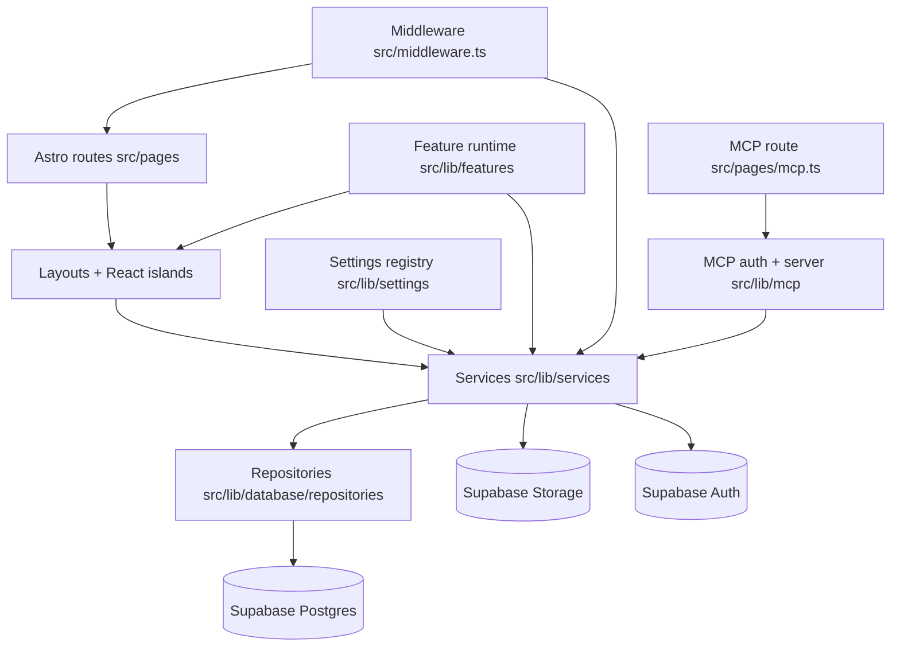

# System Map

## Purpose
This document is the fast orientation map for both humans and AI agents working in AdAstro.

## 1. Runtime Surfaces

| Surface | Entry points | Primary responsibility |
| --- | --- | --- |
| Public site | `src/pages/index.astro`, `src/pages/[slug].astro`, `src/pages/blog/*` | Render pages/posts with theme + settings |
| Admin UI | `src/pages/admin*.astro` + React islands in `src/lib/components/*` | Editorial workflow, settings, feature/theme management |
| API | `src/pages/api/*` | Auth, CRUD, setup automation, feature dispatch |
| MCP endpoint | `src/pages/mcp.ts` | Token-protected MCP over HTTP surface for remote tooling |
| Setup | `src/pages/setup.astro`, `src/pages/api/setup/*` | Guided install + setup completion gate |

## 2. Core Layering

## 3. Critical Runtime Controls

- Setup gate (global): `src/middleware.ts`
- Auth + role gate (admin/author): `src/middleware.ts`, `src/lib/auth/*`
- Feature state gate: `src/lib/features/state.ts`
- MCP token gate: `src/lib/mcp/auth.ts`
- Theme resolution: `src/lib/site-config.ts`, `src/lib/themes/*`
- Content routing resolution: `src/lib/site-config.ts`, `src/lib/routing/articles.ts`

## 4. Source of Truth by Concern

| Concern | Source of truth |
| --- | --- |
| Environment keys | `README.md`, `INSTALLATION.md`, `src/lib/supabase.ts` |
| Core schema | `infra/supabase/migrations/000_core.sql` |
| Setup checks | `src/pages/api/setup/status.ts` |
| Setup automation | `src/pages/api/setup/automate.ts` |
| Setup wizard UI | `src/lib/components/SetupWizard.tsx`, `src/lib/components/setup-wizard/*` |
| Setup runtime primitives | `src/lib/setup/runtime.ts` |
| MCP endpoint + auth | `src/pages/mcp.ts`, `src/lib/mcp/server.ts`, `src/lib/mcp/auth.ts` |
| Settings definitions | `src/lib/settings/core-definitions.ts`, `src/lib/features/*/settings.ts` |
| Features manifest | `src/lib/features/manifest.ts` |
| AI feature architecture | `docs/architecture/ai-feature.md`, `src/lib/features/ai/lib/provider-catalog.ts`, `src/lib/features/ai/lib/usage.ts` |
| Themes manifest | `src/lib/themes/manifest.ts` |
| Release gate policy | `docs/release-gates.md`, `docs/release-execution-board.md` |
| Local verification flow | `docs/engineering/local-testing.md`, `scripts/local/verify-local.mjs`, `scripts/local/verify-stability.mjs`, `scripts/ci/check-admin-consistency.mjs`, `scripts/ci/check-theme-tokens.mjs`, `scripts/ci/check-release-hygiene.mjs`, `scripts/local/verify-default-content.mjs`, `scripts/local/verify-feature-lifecycle.mjs` |

## 5. Fast Orientation Path (15 minutes)

1. Read `src/middleware.ts` (setup gate, auth gate, CSP).
2. Read `src/pages/api/setup/status.ts` and `src/pages/api/setup/automate.ts`.
3. Read `src/lib/settings/core-definitions.ts`.
4. Read `src/lib/features/types.ts`, `src/lib/features/manifest.ts`, `src/lib/features/state.ts`.
5. Read `src/lib/site-config.ts`.

## 6. Change Entry Matrix

| Goal | Start here |
| --- | --- |
| Setup/install behavior | `src/lib/components/SetupWizard.tsx`, `src/lib/components/setup-wizard/*`, `src/pages/api/setup/*`, `src/middleware.ts` |
| Post editor/media | `src/lib/components/PostEditor.tsx`, `src/lib/components/EditorJSEditor.tsx`, `src/pages/api/admin/media/upload.ts`, `src/lib/services/media-manager.ts` |
| Feature toggle behavior | `src/lib/features/state.ts`, feature `settings.ts`, Admin settings UI |
| Public page composition | `src/pages/*.astro`, `src/lib/database/repositories/page-repository.ts`, page sections |
| Theme behavior | `src/lib/themes/*`, `src/lib/site-config.ts`, `src/styles/*` |
| MCP tooling surface | `src/pages/mcp.ts`, `src/lib/mcp/auth.ts`, `src/lib/mcp/server.ts` |
